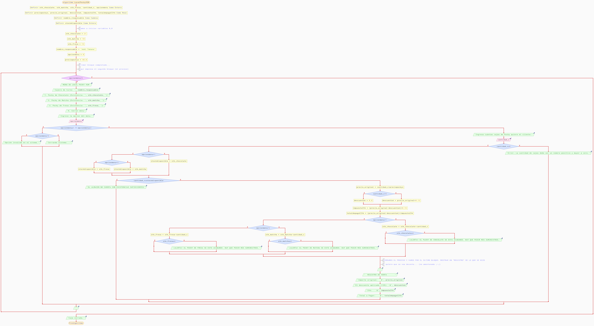

# AVANCE DE PROYECTO (FASE 1):

**MARIA ESTRELLA ARREOLA YAÑEZ**

**Importante:** La organización es ficticia.

---

**Organización:** Local Pocky YEM
**Área de impacto:** Gestión de inventario de sabores y área de cajas.
**Responsable:** Aoki Takano (cajero del local)

---

## 1. Análisis técnico y definición del problema:

### Descripción del problema:
El local tiene perdidas financieras y desabasto constante de los sabores populares de su tienda debido a que las ventas y el inventario se hacen manualmente en el cierre diario. Esto hace que haya ineficiencia en las existencias fisicas de pockys y mal conteo del dinero ganado cada día.

### Reglas del negocio: 
1. El sistema tiene que operar mostrando un menu con los tres sabores estandar que maneja el local (Chocolate, Matcha, Fresa) y tener una opción de salida vidente.
2. Cada transacción debe calcular un subtotal neto (es el resultado de restar los decuentos al precio original), evaluar si la compra excede las 6 cajas de cualquier sabor para así aplicar un 12% de descuento y cobrar el 16% de IVA.
3. Cada venta hecha debe restar las unidades del stock especifico de ese sabor. Además si el restante de ese stock es inferior/igual a 6 unidades, el sistema tiene que mandar una alerta preventiva.

---

## 2. Listado de requerimientos obligatorios:

* **R1:** Desplegar un menú donde se muestre los tres sabores que maneja el local.
    * *Variable:* opcionmenu (**Entero**)
* **R2:** Pedir al cajero la cantidad exacta de cajas que se desean adquirir.
    * *Variable:* cantidad_c (**Entero**)
* **R3:** El sistema tiene que validar la existencia fisica del sabor en el stock actual antes de proceder a la venta.
    * *Variable:* "stk_chocolate", "stk_matcha", "stk_fresa" (**Entero**)
* **R4:** Calcular el subtotal neto haciendo los descuentos si excede las 6 unidades (cajas).
    * *Variable:* "precio_original", "preciopockys" (**Real/Flotante**)
* **R5:** Calcular el descuento y aplicar el cobro final incluyendo el IVA (16%).
    * *Variable:* "descuentoA", "impuestoIVA", "totalpagoCIVA" (**Real/Flotante**)
* **R6:** Registrar el nombre del cajero responsable de la terminal.
    * *Variable:* "nombre_responsable" (**Cadena de texto/String**)

---

## 3. Operadores de lenguaje:

* **Asignación ("="/"<-"):** Guarda valores iniciales y almacena los resultados de las fórmulas matemáticas.
* **Multiplicación ("*"):** Se usa para calcular el importe tomando el precio base.
* **Resta("-"):** Se emplea para disminuir cada stock tras concretar una venta.
* **Relacionales("<=", ">", "<>", "==", "!="):** Estos operadores evaluan si hay mercancia en el almacen, si aplica el desceunto y para controlar el bucle while.
* **Lógicos("Y", "and"):** Verifican que la opción ingresada por teclado este en el rango de opciones validas (1 a 3).

---

## 3. Estructuras de control:

* **Estructura de ciclos:** Hay que simular una caja... así que el programa se tiene que mantenere en ejecución y poner una opción de salir. ('While')
* **Estructura de desición:** Se tiene "leer" a los stocks por sabor, hacer descuentos por mayoreo y mostrar alarmas cuando haya poco inventario... posiblemente un ('if-elif-else')

---

## 4. Diseño de algoritmo (Pseudocódigo en Psent):

Algoritmo LocalPockyYEM
	Definir stk_chocolate, stk_matcha, stk_fresa, cantidad_c, opcionmenu Como Entero
	Definir preciopockys, precio_original, descuentoA, impuestoIVA, totaldepagoCIVA Como Real
	Definir nombre_responsable Como Cadena
	Definir stockdisponible Como Entero
	// Vamos a iniciar variables 0_0
	stk_chocolate <- 21
	stk_matcha <- 18
	stk_fresa <- 15
	nombre_responsable <- "Aoki Takano"
	opcionmenu <- 0
	preciopockys <- 48.0
	// Primer bloque completado...
	// Aquí empieza el segundo bloque (el proceso)
	Mientras opcionmenu<>4 Hacer
		Escribir "MENU DE LOCAL POCKY YEM"
		Escribir "Cajero de turno: ", nombre_responsable
		Escribir "1. Pocky de Chocolate (Existencia: ", stk_chocolate, ")"
		Escribir "2. Pocky de Matcha (Existencia: ", stk_matcha, ")"
		Escribir "3. Pocky de Fresa (Existencia: ", stk_fresa, ")"
		Escribir "4. Cerrar menu"
		Escribir "Ingrese la opcion del menu:"
		Leer opcionmenu
		Si opcionmenu>=1 Y opcionmenu<=3 Entonces
			Escribir "Ingresa cuántas cajas de Pocky quiere el cliente:"
			Leer cantidad_c
			Si cantidad_c<=0 Entonces
				Escribir "Error: La cantidad de cajas debe ser un número positivo y mayor a cero."
			SiNo
				Si opcionmenu=1 Entonces
					stockdisponible <- stk_chocolate
				SiNo
					Si opcionmenu=2 Entonces
						stockdisponible <- stk_matcha
					SiNo
						stockdisponible <- stk_fresa
					FinSi
				FinSi
				Si cantidad_c<=stockdisponible Entonces
					precio_original <- cantidad_c*preciopockys
					Si cantidad_c>6 Entonces
						descuentoA <- precio_original*0.12
					SiNo
						descuentoA <- 0.0
					FinSi
					impuestoIVA <- (precio_original-descuentoA)*0.16
					totaldepagoCIVA <- (precio_original-descuentoA)+impuestoIVA
					Si opcionmenu=1 Entonces
						stk_chocolate <- stk_chocolate-cantidad_c
						Si stk_chocolate<=6 Entonces
							Escribir "¡ALERTA! EL PoCKY DE CHOCOLATE SE ESTA ACABANDO. HAY QUE PEDIR MÁS SUMINISTROS."
						FinSi
					SiNo
						Si opcionmenu=2 Entonces
							stk_matcha <- stk_matcha-cantidad_c
							Si stk_matcha<=6 Entonces
								Escribir "¡ALERTA! EL POCKY DE MATCHA SE ESTÁ ACABANDO. HAY QUE PEDIR MÁS SUMINISTROS."
							FinSi
						SiNo
							stk_fresa <- stk_fresa-cantidad_c
							Si stk_fresa<=6 Entonces
								Escribir "¡ALERTA! EL POCKY DE FRESA SE ESTÁ ACABANDO. HAY QUE PEDIR MÁS SUMINSITROS."
							FinSi
						FinSi
					FinSi
					// CERRAMOS EL PROCESO Y VAMOS POR EL ÚLTIMO BLOQUE: MOSTRAR UN "REGISTRO" DE LO QUE SE HIZO
					// Y quiero que se vea decente... (no amontonado ;-;)
					Escribir ""
					Escribir "		REGISTRO DE VENTA       "
					Escribir "Importe original:   $", precio_original
					Escribir "El descuento aplicado (12%): -$", descuentoA
					Escribir "IVA:    $", impuestoIVA
					Escribir "Total a Pagar:    $", totaldepagoCIVA
				SiNo
					Escribir "EL ALMACEN NO CUENTA CON EXISTENCIAS SUFIECIENTES"
				FinSi
			FinSi
		SiNo
			Si opcionmenu=4 Entonces
				Escribir "Cerrando sistema..."
			SiNo
				Escribir "Opción invalida en el sitema."
			FinSi
		FinSi
		Escribir ""
	FinMientras
	Escribir "Caja cerrada."
FinAlgoritmo

---

## 5. Diseño de algoritmo (Diagrama de flujo sacado de Psent):

---

## 6. Prototipo del código fuente (Python):

#Vamos a iniciar variables 0_0

stk_chocolate = 21
stk_matcha = 18
stk_fresa = 15

nombre_responsable = "Aoki Takano"

opcionmenu = 0
preciopockys = 48

#Primer bloque completado... 
#Aquí empieza el segundo bloque (el proceso)

while opcionmenu !=4:
    print("MENU DE LOCAL POCKY YEM")
    print(f"Cajero de turno: {nombre_responsable}")
    print(f"1. Pocky de Chocolate (Existencia: {stk_chocolate})")
    print(f"2 Pocjy de Matcha (Existencia: {stk_matcha})")
    print(f"3. Pcky de Fresa (Existencia: {stk_fresa})")
    print("4. Cerrar menu")

 
    opcionmenu = int(input("Ingrese el sabor requerido por el cliente: "))

    if 1 <= opcionmenu <=3:
        cantidad_c = int(input("Ingresa cuántas cajas de Pocky quiere el cliente: "))
    

        if cantidad_c <= 0:
            print("Error: La cantidad de cajas debe ser un número positivo y mayor a cero.")
            continue

        if opcionmenu == 1:
            stockdisponible = stk_chocolate
        elif opcionmenu == 2: 
            stockdisponible = stk_matcha
        else:
            stockdisponible = stk_fresa

        if cantidad_c <= stockdisponible:
            precio_original = cantidad_c * preciopockys

            if cantidad_c > 6:
                descuentoA = precio_original * 0.12
            else:
                descuentoA = 0.0

            impuestoIVA = (precio_original - descuentoA) * 0.16
            totaldepagoCIVA = (precio_original - descuentoA) + impuestoIVA

            if opcionmenu == 1:
                stk_chocolate = stk_chocolate - cantidad_c
                if stk_chocolate <= 6:
                    print("¡ALERTA! EL PoCKY DE CHOCOLATE SE ESTA ACABANDO. HAY QUE PEDIR MÁS SUMINISTROS.")
            elif opcionmenu == 2:
                stk_matcha = stk_matcha - cantidad_c
                if stk_matcha <= 6:
                    print("¡ALERTA! EL POCKY DE MATCHA SE ESTÁ ACABANDO. HAY QUE PEDIR MÁS SUMINISTROS.")
            elif opcionmenu == 3:
                stk_fresa = stk_fresa - cantidad_c
                if stk_fresa <=6:
                    print("¡ALERTA! EL POCKY DE FRESA SE ESTÁ ACABANDO. HAY QUE PEDIR MÁS SUMINSITROS.")

                    # CERRAMOS EL PROCESO Y VAMOS POR EL ÚLTIMO BLOQUE: MOSTRAR UN "REGISTRO" DE LO QUE SE HIZO 
                    # Y quiero que se vea decente... (no amontonado ;-;)

            print("\n     REGISTRO DE VENTA       ")
            print(f"Importe original:   ${precio_original:.2f}")
            print(f"El descuento aplicado (12%): -${descuentoA:.2f}")
            print(f"IVA:    ${impuestoIVA:.2f}")
            print(f"Total a Pagar:    ${totaldepagoCIVA:.2f}")
        else:
            print("EL ALMACEN NO CUENTA CON EXISTENCIAS SUFIECIENTES")

    elif opcionmenu == 4:
        print("Cerrando sistema...")
    else:
        print("Opción invalida en el sitema.")

print("Caja cerrada.")
    
---